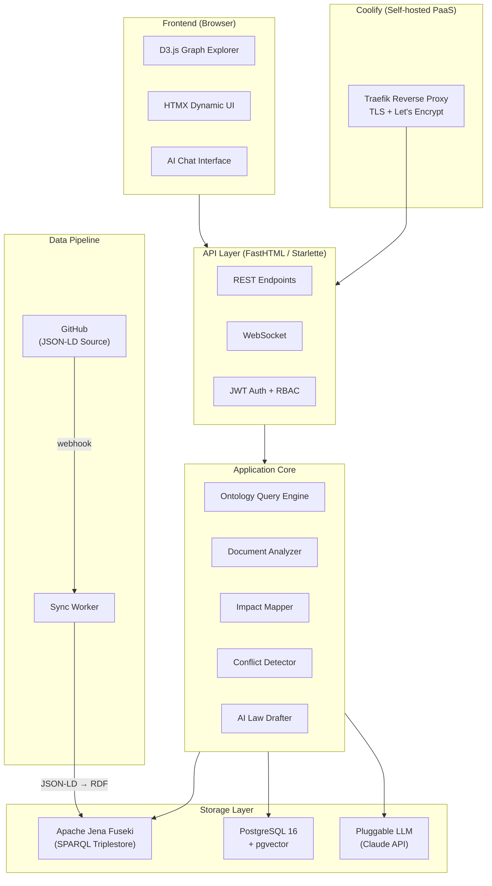
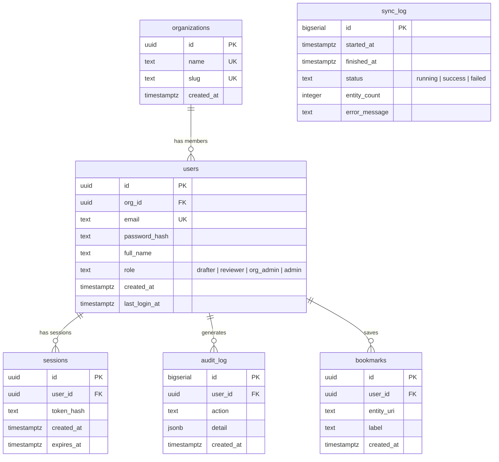
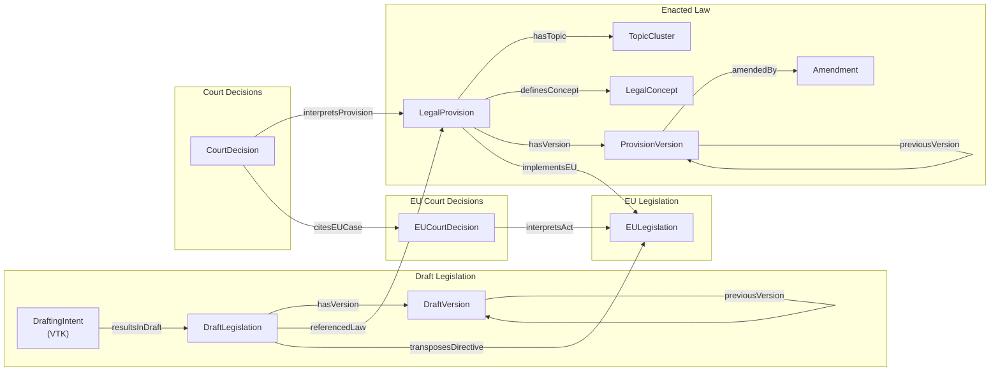
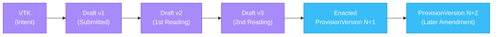
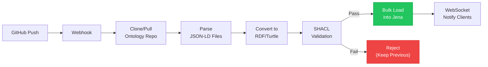
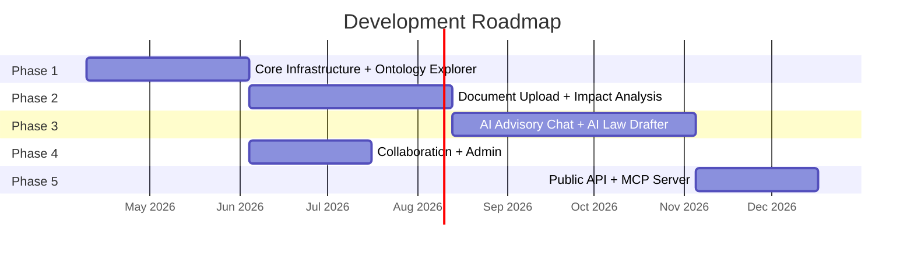

# Seadusloome — Estonian Legal Ontology Advisory Software

Advisory software that helps Estonian government officials in the law creation process. Upload a draft law or describe legislative intent in natural language — the system maps it against the existing legal framework, showing connections, conflicts, and impacts.

**[Kanban Board](https://github.com/users/henrikaavik/projects/2)**

## What It Does

A government official uploads a draft law (or describes what a new law should achieve). The system maps it against:

- **615** enacted Estonian laws
- **22,832** draft legislation items
- **12,137** Supreme Court decisions
- **33,242** EU legal acts
- **22,290** EU court decisions

The result: an interactive graph showing exactly how the draft connects to and impacts the existing legal framework, with conflict detection, gap analysis, EU compliance checking, and AI-powered drafting assistance.

## Architecture



## Database Schema



## Ontology Data Model



## Legislative Lifecycle



## Sync Pipeline



## Tech Stack

| Layer | Technology |
|-------|-----------|
| Server | FastHTML (Python 3.13) |
| Frontend | D3.js + HTMX + Vanilla JS |
| Triplestore | Apache Jena Fuseki (SPARQL) |
| Database | PostgreSQL 16 + pgvector |
| AI | Pluggable LLM (Claude API primary) |
| Embeddings | multilingual-e5-large / EstBERT |
| Auth | JWT (TARA SSO-ready via OIDC) |
| Deployment | Coolify on Hetzner VPS |
| CI/CD | GitHub Actions + Coolify webhooks |
| Linting | ruff + pyright |
| Package Manager | uv |

## Deploying

Every push to `main` runs lint + type-check + tests via GitHub Actions. On
green CI, a `deploy` job fires a Coolify webhook which rebuilds and
redeploys the container.

**One-time setup (required after cloning the repo into a new GitHub org):**

1. In Coolify, open the Seadusloome application → **Deployments** → **Webhooks** → copy the *Deploy* URL.
2. In GitHub, go to **Settings → Secrets and variables → Actions → New repository secret**.
3. Name: `COOLIFY_DEPLOY_HOOK_URL` · Value: *the URL from step 1*.

Without the secret, the CI `deploy` job gracefully no-ops (it logs a
skip notice and exits `0`), so the rest of the pipeline still passes.
You can still trigger manual deploys from the Coolify UI.

## Development Phases



| Phase | Scope | Dependencies |
|-------|-------|-------------|
| 1 | Core Infrastructure + Ontology Explorer | None |
| 2 | Document Upload + Impact Analysis | Phase 1 |
| 3 | AI Advisory Chat + AI Law Drafter | Phase 2 |
| 4 | Collaboration + Admin | Phase 1 |
| 5 | Public API + MCP Server | Phase 3 |

## Modules

1. **Core Infrastructure** — FastHTML scaffolding, PostgreSQL, Jena Fuseki, sync pipeline, JWT auth, Coolify deployment
2. **Ontology Explorer** — D3.js interactive graph with SPARQL-backed lazy loading, timeline view, version history
3. **Document Upload** — .docx/.pdf parsing, Estonian legal NLP, temporary named graph integration
4. **Impact Analysis** — SPARQL traversal, conflict detection, EU compliance, gap analysis
5. **AI Advisory Chat** — RAG pipeline, ontology-aware prompting, streaming Estonian responses
6. **AI Law Drafter** — Intent-to-draft pipeline: VTK or full law from natural language description
7. **User Management** — Organizations, roles, shared workspaces, audit logging
8. **Public API + MCP Server** — REST API + MCP protocol for third-party integrations (post-MVP)
9. **Monitoring & Admin** — Health dashboard, usage analytics, cost tracking

## Local Development

```bash
# Prerequisites: Python 3.13, uv, Docker

# Install dependencies
uv sync

# Start Jena Fuseki + PostgreSQL
docker compose -f docker/docker-compose.yml up -d

# Run migrations
uv run scripts/migrate.py

# Sync ontology data (first run)
uv run scripts/sync.py

# Start dev server
uv run app/main.py
```

## Data Sources

- **Ontology:** [github.com/henrikaavik/estonian-legal-ontology](https://github.com/henrikaavik/estonian-legal-ontology)
- **Enacted Laws:** [Riigi Teataja](https://www.riigiteataja.ee)
- **Draft Legislation:** [Eelnõude Infosüsteem (EIS)](https://eelnoud.valitsus.ee)
- **Court Decisions:** [Riigikohus](https://www.riigikohus.ee)
- **EU Legislation:** [EUR-Lex](https://eur-lex.europa.eu)
- **EU Court Decisions:** [CURIA](https://curia.europa.eu)

## License

Proprietary. All rights reserved.
