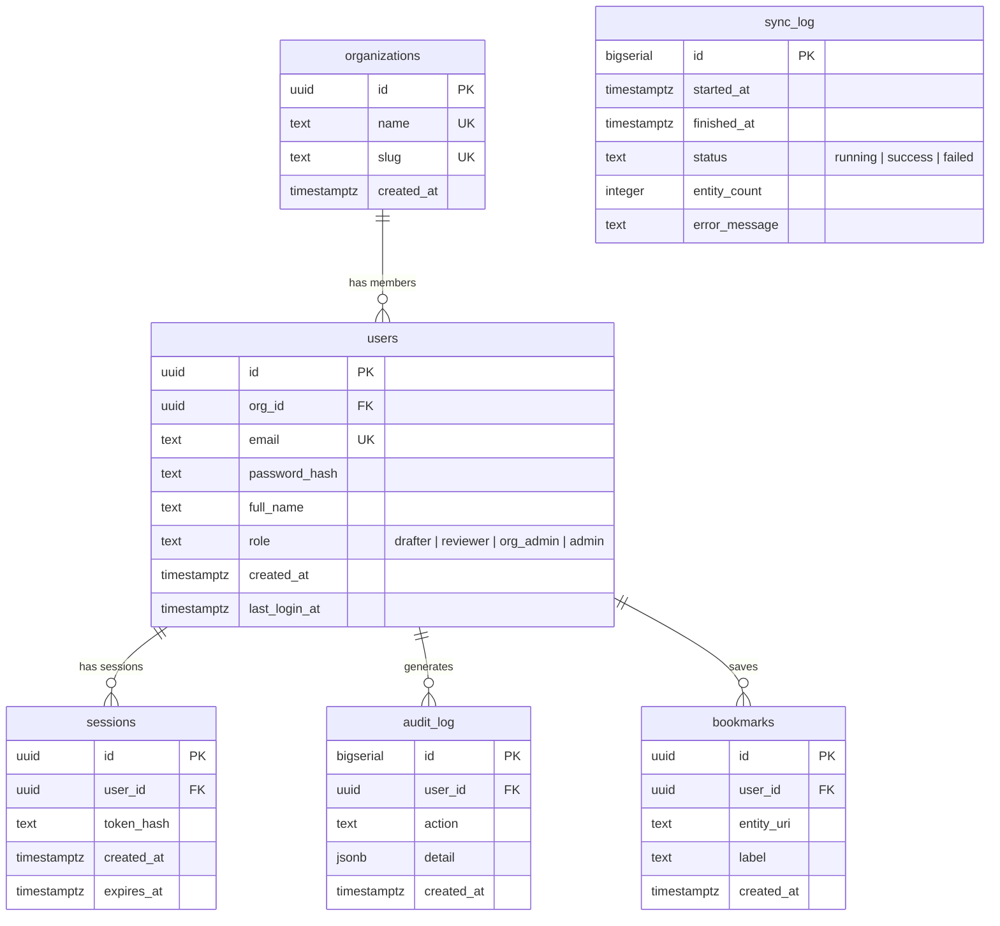
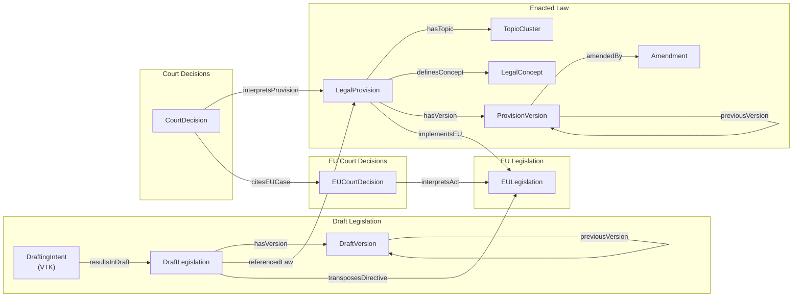
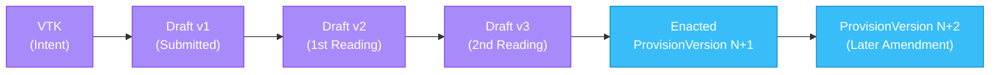
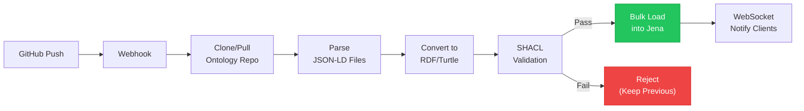
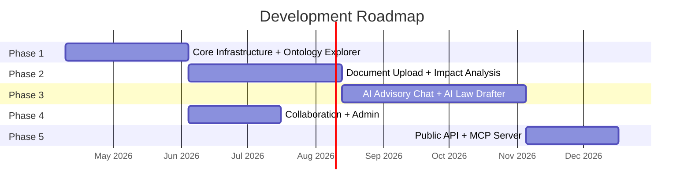

# Seadusloome — Estonian Legal Ontology Advisory Software

Advisory software that helps Estonian government officials in the law creation process. Upload a draft law or describe legislative intent in natural language — the system maps it against the existing legal framework, showing connections, conflicts, and impacts.

**[Kanban Board](https://github.com/users/henrikaavik/projects/2)**

## What It Does

A government official uploads a draft law (or describes what a new law should achieve). The system maps it against:

- **615** enacted Estonian laws
- **22,832** draft legislation items
- **12,137** Supreme Court decisions
- **33,242** EU legal acts
- **22,290** EU court decisions

The result: an interactive graph showing exactly how the draft connects to and impacts the existing legal framework, with conflict detection, gap analysis, EU compliance checking, and AI-powered drafting assistance.

## Architecture


## Database Schema



## Ontology Data Model



## Legislative Lifecycle



## Sync Pipeline



## Tech Stack

| Layer | Technology |
|-------|-----------|
| Server | FastHTML (Python 3.13) |
| Frontend | D3.js + HTMX + Vanilla JS |
| Triplestore | Apache Jena Fuseki (SPARQL) |
| Database | PostgreSQL 18 + pgvector |
| AI | Pluggable LLM (Claude API primary) |
| Embeddings | multilingual-e5-large / EstBERT |
| Auth | JWT (TARA SSO-ready via OIDC) |
| Deployment | Coolify on Hetzner VPS |
| CI/CD | GitHub Actions + Coolify webhooks |
| Linting | ruff + pyright |
| Package Manager | uv |

## Deploying

Every push to `main` runs lint + type-check + tests via GitHub Actions.
On green CI, a `deploy` job calls Coolify's authenticated Deploy API to
rebuild and redeploy the container.

**One-time setup (required after cloning the repo into a new GitHub org):**

Coolify's Deploy Webhook is an authenticated API endpoint, so you need
TWO GitHub Actions secrets:

1. **`COOLIFY_DEPLOY_HOOK_URL`** — the deploy URL from Coolify
   - In Coolify: open `seadusloome-app` → **Webhooks** tab → copy the value of
     the **"Deploy Webhook (auth required)"** field. It looks like
     `https://app.coolify.io/api/v1/deploy?uuid=<long-id>`.
2. **`COOLIFY_API_TOKEN`** — a Coolify API token with deploy permission
   - In Coolify: click your avatar top-right → **Keys & Tokens** → **API Tokens** → **Create New Token**.
   - Give it a name like `github-actions-deploy` and check the **write** scope
     (or **read:application write:deployment** if scoped tokens are available).
   - Copy the token immediately — Coolify only shows it once.

Add both to GitHub: **Settings → Secrets and variables → Actions → New repository secret**.

Without both secrets, the CI `deploy` job gracefully warns and no-ops
(it logs a skip notice and exits `0`), so the rest of the pipeline still
passes. You can still trigger manual deploys from the Coolify UI.

### Phase 2 setup — Document Upload + Impact Analysis

Phase 2 adds encrypted file storage, Tika document parsing, Claude entity
extraction, and impact reports. These require three additional prod
configuration steps beyond the Phase 1 webhook setup.

**Step 1 — Set APP_ENV=production in Coolify.**

Critical: without this, the storage module falls into dev mode and
generates a fresh Fernet key per container restart. All previously
uploaded draft files become permanently undecryptable on the next
restart. Set `APP_ENV=production` as a Runtime environment variable on
`seadusloome-app`.

**Step 2 — Generate and set STORAGE_ENCRYPTION_KEY.**

Run this locally to generate a key:

    uv run python -c "from app.storage.encrypted import generate_encryption_key; print(generate_encryption_key())"

Copy the output (a 44-character url-safe base64 string) and set it as
`STORAGE_ENCRYPTION_KEY` in Coolify's env vars panel. This key is used
by Fernet (AES-128-CBC + HMAC-SHA256) to encrypt every uploaded draft.
Guard it like a password — losing it means losing access to all
previously uploaded drafts.

**Step 3 — Deploy Apache Tika as a separate Coolify application.**

Seadusloome uses Tika to extract plain text from .docx and .pdf
uploads. Deploy it as a second Coolify application in the same
project:

1. Coolify → seadusloome project → + Add New Resource → Application
2. Name: `seadusloome-tika`
3. Source: Docker Image
4. Image: `apache/tika:3.3.0.0-full`
5. Port (internal): `9998`
6. Network alias: `seadusloome-tika` (must match the env var below)
7. Domain: leave empty — Tika is internal only
8. Deploy

Once it's running, on `seadusloome-app` set:
- `TIKA_URL=http://seadusloome-tika:9998`

**Step 4 — Add two Coolify persistent volumes to seadusloome-app.**

Encrypted draft files and generated .docx reports need to survive
container restarts. **Use Coolify's named volume type, NOT bind mounts.**

1. Coolify → seadusloome-app → Persistent Storage
2. Click "+ Add". In the dialog:
   - Type: **Volume Mount** (not Bind Mount)
   - Name: `drafts`
   - Mount Path: `/var/seadusloome/drafts`
3. Click "+ Add" again:
   - Type: **Volume Mount**
   - Name: `exports`
   - Mount Path: `/var/seadusloome/exports`

Also set on seadusloome-app:
- `STORAGE_DIR=/var/seadusloome/drafts`
- `EXPORT_DIR=/var/seadusloome/exports`

**Important**: if you ever delete the seadusloome-app application from
Coolify, the named volumes are orphaned (not destroyed). You can
reattach them by creating a new application with the same mount paths.
Bind mounts point to a host directory that you manage separately —
use bind mounts only if you need to share the files with another
service or back them up externally.

**Step 5 — (Optional) Set ANTHROPIC_API_KEY for real Claude extraction.**

Phase 2 entity extraction runs in stub mode when `ANTHROPIC_API_KEY` is
unset. Set it in Coolify to enable real LLM-powered extraction. Phase 3
adds the `anthropic` Python package to pyproject.toml; until then the
real-extraction path raises a helpful error if the package is missing.

### Phase 3A setup — AI Advisory Chat + AI Law Drafter

Phase 3A ships two database migrations that run automatically on container
boot (via `docker/entrypoint.sh`), so no manual migration step is needed:

- **006_encrypt_parsed_text_and_drafting_tables.sql** — adds the
  `drafting_sessions` table and converts the `documents.parsed_text` column
  to encrypted JSONB storage.
- **007_llm_usage.sql** — adds the `llm_usage` table used by the cost
  tracker to record token consumption per feature and per user.

Both migrations are idempotent (`CREATE TABLE IF NOT EXISTS` / `CREATE INDEX
CONCURRENTLY IF NOT EXISTS`), so a re-deploy after a failed first run is safe.

Optionally set `ANTHROPIC_API_KEY` in Coolify (if not already set from Phase 2)
and `CHAT_MAX_TOKENS` (defaults to 4096) on `seadusloome-app`. No new
persistent volumes are required.

### Troubleshooting deploys

If a deploy is marked **Failed** in Coolify, open the deployment log and
look for the `Healthcheck` section. Common failure modes we have hit:

- **`curl: (22) The requested URL returned error: 400` on `/api/ping`** —
  usually means `TrustedHostMiddleware` is rejecting the `Host: localhost`
  header. The allow-list in `app/main.py` must include `localhost` and
  `127.0.0.1` or the Docker HEALTHCHECK will fail every time. Regression
  tests in `tests/test_prod_middleware.py` cover this.
- **`connection refused` to `localhost:5432` or `jena:3030`** — means
  the Coolify env vars (`DATABASE_URL`, `JENA_URL`) are not being
  injected at runtime. Verify they are set under
  `seadusloome-app → Environment Variables → Production`, not just Preview.
- **Healthcheck passes but the app can't reach Jena** — make sure
  `seadusloome-jena` has a **Network Alias** `jena` configured, otherwise
  `http://jena:3030` won't resolve inside the Coolify network.
- **Uploads stuck at status=uploaded forever** — check whether
  `DISABLE_BACKGROUND_WORKER` is set in Coolify. It should NOT be set
  in production. pytest/conftest.py sets it at test time only.
- **First upload returns PermissionError** — the Dockerfile should
  `mkdir -p /var/seadusloome/{drafts,exports}` and `chown -R appuser`
  before `USER appuser`. If this is missing, see ticket #444.
- **Draft stuck at parsing forever** — `TIKA_URL` is unset or
  unreachable. Verify `seadusloome-tika` is running (Coolify →
  seadusloome-tika → Logs). Check `TIKA_URL` on `seadusloome-app`.

## Development Phases



| Phase | Scope | Dependencies |
|-------|-------|-------------|
| 1 | Core Infrastructure + Ontology Explorer | None |
| 2 | Document Upload + Impact Analysis | Phase 1 |
| 3 | AI Advisory Chat + AI Law Drafter | Phase 2 |
| 4 | Collaboration + Admin | Phase 1 |
| 5 | Public API + MCP Server | Phase 3 |

## Modules

1. **Core Infrastructure** — FastHTML scaffolding, PostgreSQL, Jena Fuseki, sync pipeline, JWT auth, Coolify deployment
2. **Ontology Explorer** — D3.js interactive graph with SPARQL-backed lazy loading, timeline view, version history
3. **Document Upload** — .docx/.pdf parsing, Estonian legal NLP, temporary named graph integration
4. **Impact Analysis** — SPARQL traversal, conflict detection, EU compliance, gap analysis
5. **AI Advisory Chat** — RAG pipeline, ontology-aware prompting, streaming Estonian responses
6. **AI Law Drafter** — Intent-to-draft pipeline: VTK or full law from natural language description
7. **User Management** — Organizations, roles, shared workspaces, audit logging
8. **Public API + MCP Server** — REST API + MCP protocol for third-party integrations (post-MVP)
9. **Monitoring & Admin** — Health dashboard, usage analytics, cost tracking

## Local Development

```bash
# Prerequisites: Python 3.13, uv, Docker

# Install dependencies
uv sync

# Start Jena Fuseki + PostgreSQL
docker compose -f docker/docker-compose.yml up -d

# Run migrations
uv run scripts/migrate.py

# Sync ontology data (first run)
uv run scripts/sync.py

# Start dev server
uv run app/main.py
```

## Data Sources

- **Ontology:** [github.com/henrikaavik/estonian-legal-ontology](https://github.com/henrikaavik/estonian-legal-ontology)
- **Enacted Laws:** [Riigi Teataja](https://www.riigiteataja.ee)
- **Draft Legislation:** [Eelnõude Infosüsteem (EIS)](https://eelnoud.valitsus.ee)
- **Court Decisions:** [Riigikohus](https://www.riigikohus.ee)
- **EU Legislation:** [EUR-Lex](https://eur-lex.europa.eu)
- **EU Court Decisions:** [CURIA](https://curia.europa.eu)

## License

Proprietary. All rights reserved.
